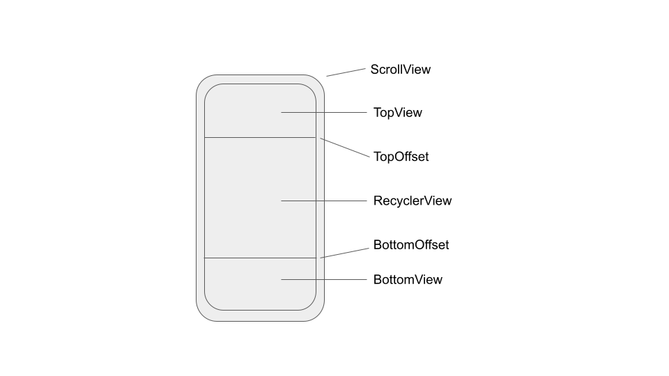
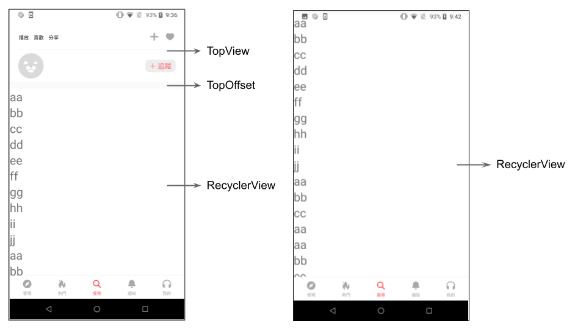
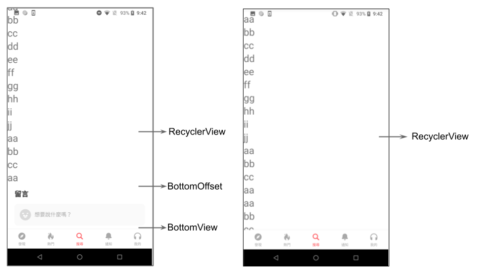

# NestedScrollableRecyclerView

---

此 CustomView 元件的設計想法為 ScrollView 裡面嵌了 上半部 View，RecyclerView，下半部 View 三項 View 元件，並且根據這三項元件的大小，是否存在，自動進行畫面的調整．

透過邏輯設計，達到當 RecyclerView 滑動到畫面中間時，切換為 RecyclerView 的滑動．

 

．元件概念

> 將畫面分成三段，TopView，RecyclerView，BottomView
最外層用 ScrollView 包起來． 
> 在滑動的過程中，當頂端尚未達到 TopOffset 時，滑動的事件接收是由 ScrollView 處理，而此時 RecyclerView 為靜止，
當 TopOffset 達到
畫面頂端時，固定 ScrollView，開始滑動 RecyclerView，且滑動動作必須要連貫，
反之往下滑時則參考 BottomOffset
與螢幕底端做 ScrollView，RecyclerView 切換．

 

． 滑動機制 - 下滑

> 當下滑時，TopOffset 到達螢幕頂端前，滑動事件由 scrollView 處理，達到螢幕頂端後，滑動事件就改由 RecyclerView 處理．

 

．滑動機制 - 上滑

> 當上滑時，BottomOffset 到達螢幕底端前，滑動事件由 scrollView 處理，達到螢幕底端後，滑動事件就改由 RecyclerView 處理．

 

## 使用方法

1. 此元件為 Custom NestedScrollView，使用時須先在 xml 檔裡引入此元件

1. 將欲呈現畫面拆成 TopView，RecyclerView，BottomView 三個部分，並先把 View 的內容先設置好 (包括 listener)，再呼叫 NestedScrollableRecyclerView initView function() 將此三個參數傳入，元件便會自行完成滑動設置．
